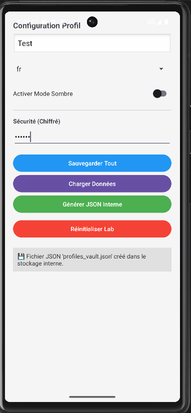

# LAB 14 : Sauvegarde des données – SharedPreferences et fichiers

Une application Android en Java démontrant les différentes méthodes de stockage local sécurisé et de persistance des données.

## Aperçu de l'application

## Fonctionnalités
* **SharedPreferences** : Stockage des préférences utilisateur (Alias, Langue, Thème).
* **EncryptedSharedPreferences** : Stockage sécurisé du token API via AndroidX Security Crypto.
* **Stockage Interne** : Sauvegarde de données structurées au format **JSON**.
* **Gestion du Cache** : Utilisation du répertoire temporaire pour les logs d'actions.
* **Export Externe** : Exportation de fichiers vers le stockage spécifique à l'application.

## Installation
1. Cloner le dépôt.
2. Ouvrir avec **Android Studio ** .
3. Synchroniser Gradle et lancer sur un émulateur (API 24+).

## Sécurité
L'application applique les règles strictes de sécurité Android : `MODE_PRIVATE`, chiffrement AES256 pour les secrets et absence de logs sensibles dans Logcat.